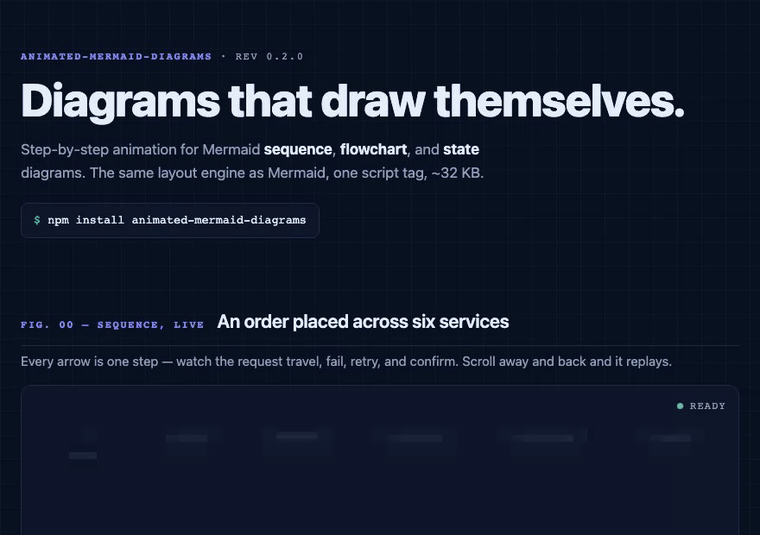

# animated-mermaid-diagrams

Drop-in animated rendering for Mermaid diagrams. Accepts Mermaid syntax or a JS config, renders animated SVGs that auto-play on scroll. One dependency: [`@dagrejs/dagre`](https://github.com/dagrejs/dagre) — the same layout engine Mermaid uses.

**[Live demo →](https://neolivz.github.io/animated-mermaid-diagrams/demo/)** — every diagram type animated, click-to-explore, keyboard control. [Side-by-side with Mermaid](https://neolivz.github.io/animated-mermaid-diagrams/demo/compare.html).



## Install

```bash
npm install animated-mermaid-diagrams
```

## Vision

Animate every Mermaid diagram type — done. `1.0.0` ships all thirteen core types with a stable API: sequence, flowchart, state, user journey, timeline, class, ER, pie, Gantt, mindmap, sankey, git graph, and architecture.

### Roadmap

Milestones, in order (versions are indicative — features ship as they're ready in pre-1.0 minors):

| Milestone | Diagram types | Status |
| --------- | ------------- | ------ |
| v1.0 | Sequence, Flowchart, State Diagram | shipped in 0.1.0–0.2.0 |
| v1.1 | Journey, Timeline | shipped in 0.3.0 |
| v1.2 | Class Diagram, ER Diagram | shipped in 0.4.0 |
| v1.3 | Pie, Gantt | shipped in 0.5.0 |
| v2.0 | Mindmap, Sankey, Git Graph, Architecture | shipped in 0.6.0 |

## Input: Mermaid syntax or JS config

Every diagram type accepts either raw Mermaid text or a structured JS config. Mermaid input is parsed into the same internal config, so both paths produce identical output.

### Mermaid syntax input

```js
import { render } from 'animated-mermaid-diagrams'

render(container, `
  sequenceDiagram
    actor User
    participant App
    participant Backend

    User->>App: Click delete on item
    App->>Backend: GET resource usage
    Backend-->>App: Returns list with linked record
    App-->>User: Show dialog with linked record
    User->>App: Click the record link
    Note over App: Router intercepts navigation
    App-->>User: Record editor loads
`)
```

The `render()` function auto-detects the diagram type from the Mermaid syntax (first line: `sequenceDiagram`, `flowchart`, `stateDiagram-v2`, etc.) and delegates to the correct renderer.

### JS config input

For programmatic use, or for the config-only extras Mermaid syntax can't express: `highlight` on individual steps/nodes/states, and hand-built `frames` / `activations` / `groups`.

```js
import { render } from 'animated-mermaid-diagrams'

render(container, {
  type: 'sequence',
  // ... type-specific config (see below)
})
```

Or import individual renderers directly (tree-shakeable):

```js
import { sequence, flowchart, stateDiagram } from 'animated-mermaid-diagrams'
```

---

## Diagram Types

### Sequence Diagram

#### Mermaid input

```js
render(container, `
  sequenceDiagram
    actor User
    participant App
    participant Backend

    User->>App: Click delete
    App->>Backend: GET resource usage
    Backend-->>App: Returns list
    Note over App: Router intercepts
    App-->>User: Record editor loads
`)
```

#### JS config input

```js
import { sequence } from 'animated-mermaid-diagrams'

sequence(container, {
  actors: [
    { id: 'user', label: 'User', type: 'actor' },
    { id: 'app', label: 'App' },
    { id: 'backend', label: 'Backend' },
  ],
  steps: [
    { from: 'user', to: 'app', text: 'Click delete' },
    { from: 'app', to: 'backend', text: 'GET resource usage' },
    { from: 'backend', to: 'app', text: 'Returns list', type: 'response' },
    { over: 'app', text: 'Router intercepts', type: 'note' },
    { from: 'app', to: 'user', text: 'Record editor loads', type: 'response', highlight: true },
  ],
})
```

#### Step schema

| Field | Type | Required | Description |
| ----- | ---- | -------- | ----------- |
| `from` | `string` | yes (message) | Source actor id |
| `to` | `string` | yes (message) | Target actor id |
| `text` | `string` | yes | Message or note text |
| `type` | `'request' \| 'response' \| 'note'` | no | Default `'request'`. `response` renders dashed arrow. `note` renders a box over the actor(s) |
| `over` | `string \| string[]` | yes (note) | Actor id(s) the note spans. Used instead of from/to for notes |
| `highlight` | `boolean \| 'red' \| 'green'` | no | Highlight this step with accent color — `true`/`'green'` use the `highlight` token, `'red'` uses `highlightRed` |
| `failed` | `boolean` | no | Renders an X terminator instead of an arrowhead (parsed from Mermaid `-x` / `--x`) |

#### Actor schema

| Field | Type | Required | Description |
| ----- | ---- | -------- | ----------- |
| `id` | `string` | yes | Unique identifier |
| `label` | `string` | yes | Display name |
| `type` | `'actor' \| 'participant'` | no | Default `'participant'`. `actor` renders as a person icon, `participant` as a box |

#### Config fields

| Field | Type | Required | Description |
| ----- | ---- | -------- | ----------- |
| `actors` | `SequenceActor[]` | yes | Participants, laid out left to right |
| `steps` | `SequenceStep[]` | yes | Messages and notes, in order |
| `frames` | `SequenceFrame[]` | no | `alt`/`opt`/`loop`/`par` boxes, each spanning an inclusive `fromStep`–`toStep` range with optional `sections` (see [Sequence diagram syntax](#sequence-diagram-syntax)) |
| `activations` | `SequenceActivation[]` | no | Activation bars on one actor's lifeline over an inclusive step range (see [Sequence diagram syntax](#sequence-diagram-syntax)) |

#### Animation behaviour

- Vertical dashed lifelines drop from each actor box
- Request arrows: solid line, draws via stroke-dashoffset animation
- Response arrows: dashed line, same draw animation
- Self-messages (from === to): curved arrow looping back to the same lifeline
- Notes: rounded rect fading in over lifeline(s)
- Steps animate in sequence with configurable stagger

---

### Flowchart

#### Mermaid input

```js
render(container, `
  flowchart TD
    A[Navigate to /items/id] --> B{Editable?}
    B -->|yes| C[Open editor]
    B -->|no| D[Show read-only view]
`)
```

#### JS config input

```js
import { flowchart } from 'animated-mermaid-diagrams'

flowchart(container, {
  nodes: [
    { id: 'start', text: 'Navigate to /items/{id}', shape: 'rounded' },
    { id: 'check', text: 'Editable?', shape: 'diamond' },
    { id: 'editor', text: 'Open editor', shape: 'rounded', highlight: true },
    { id: 'readonly', text: 'Show read-only view', shape: 'rounded' },
  ],
  edges: [
    { from: 'start', to: 'check' },
    { from: 'check', to: 'editor', label: 'yes' },
    { from: 'check', to: 'readonly', label: 'no' },
  ],
  direction: 'TB',
})
```

#### Node schema

| Field | Type | Required | Description |
| ----- | ---- | -------- | ----------- |
| `id` | `string` | yes | Unique identifier |
| `text` | `string` | yes | Display text |
| `shape` | `'rect' \| 'rounded' \| 'diamond' \| 'circle' \| 'stadium'` | no | Default `'rounded'` |
| `highlight` | `boolean \| 'red' \| 'green'` | no | Accent color for important nodes — `true`/`'green'` use the `highlight` token, `'red'` uses `highlightRed` |
| `group` | `string` | no | Id of the enclosing subgraph, from `groups` |

#### Edge schema

| Field | Type | Required | Description |
| ----- | ---- | -------- | ----------- |
| `from` | `string` | yes | Source node id |
| `to` | `string` | yes | Target node id |
| `label` | `string` | no | Edge label text |
| `type` | `'solid' \| 'dashed'` | no | Default `'solid'` |

#### Config fields

| Field | Type | Required | Description |
| ----- | ---- | -------- | ----------- |
| `nodes` | `FlowNode[]` | yes | Graph nodes |
| `edges` | `FlowEdge[]` | yes | Connections between nodes |
| `direction` | `FlowDirection` | no | Default `'TB'` |
| `groups` | `FlowchartGroup[]` | no | Subgraph containers (`{ id, title, parent? }`), referenced by each member node's `group` (see [Flowchart syntax](#flowchart-syntax)) |

#### Direction

`'TB'` (top-bottom), `'LR'` (left-right), `'BT'`, `'RL'`

#### Animation behaviour

- Auto-layout: dagre layout — the same engine Mermaid uses
- Edges rendered as SVG paths with arrowhead markers
- Nodes fade/scale in layer by layer, then edges draw themselves to connect them
- Diamond nodes render as true diamonds with text centered
- Self-edges render as a small loop beside the node

---

### State Diagram

#### Mermaid input

```js
render(container, `
  stateDiagram-v2
    [*] --> Idle
    Idle --> Loading : fetch()
    Loading --> Ready : success
    Loading --> Error : failure
    Error --> Loading : retry()
    Ready --> Idle : reset()
`)
```

#### JS config input

```js
import { stateDiagram } from 'animated-mermaid-diagrams'

stateDiagram(container, {
  states: [
    { id: 'idle', text: 'Idle' },
    { id: 'loading', text: 'Loading' },
    { id: 'ready', text: 'Ready' },
    { id: 'error', text: 'Error', highlight: 'red' },
  ],
  transitions: [
    { from: 'idle', to: 'loading', label: 'fetch()' },
    { from: 'loading', to: 'ready', label: 'success' },
    { from: 'loading', to: 'error', label: 'failure' },
    { from: 'error', to: 'loading', label: 'retry()' },
    { from: 'ready', to: 'idle', label: 'reset()' },
  ],
  initial: 'idle',
})
```

#### State schema

| Field | Type | Required | Description |
| ----- | ---- | -------- | ----------- |
| `id` | `string` | yes | Unique identifier |
| `text` | `string` | yes | Display text |
| `type` | `'default' \| 'start' \| 'end'` | no | `start` renders a filled circle, `end` renders a circle with inner dot |
| `highlight` | `boolean \| 'red' \| 'green'` | no | Accent color — `true`/`'green'` use the `highlight` token, `'red'` uses `highlightRed` |
| `group` | `string` | no | Id of the enclosing composite state, from `groups` |

#### Transition schema

| Field | Type | Required | Description |
| ----- | ---- | -------- | ----------- |
| `from` | `string` | yes | Source state id |
| `to` | `string` | yes | Target state id |
| `label` | `string` | no | Transition label |

#### Config fields

| Field | Type | Required | Description |
| ----- | ---- | -------- | ----------- |
| `states` | `StateNode[]` | yes | States in the machine |
| `transitions` | `StateTransition[]` | yes | Transitions between states |
| `initial` | `string` | no | Entry state; drives the start dot and the BFS reveal order |
| `groups` | `DiagramGroup[]` | no | Composite-state containers (`{ id, title, parent? }`), referenced by each member state's `group` (see [State diagram syntax](#state-diagram-syntax)) |

#### Animation behaviour

- States rendered as rounded rectangles
- Start state has a filled circle before it, end state has a circle-in-circle after it
- Transitions are smoothed dagre-routed arrows between states with labels
- Initial state appears first, then transitions draw one-by-one following BFS from initial state, each target state appearing as the transition reaches it
- Self-transitions (from === to): loop arrow above the state

### User Journey

#### Mermaid input

```js
render(container, `
  journey
    title My working day
    section Go to work
      Make tea: 5: Me
      Go upstairs: 3: Me
      Do work: 1: Me, Cat
    section Go home
      Go downstairs: 5: Me
      Sit down: 5: Me
`)
```

#### JS config input

```js
import { journey } from 'animated-mermaid-diagrams'

journey(container, {
  title: 'My working day',
  sections: [
    {
      title: 'Go to work',
      tasks: [
        { name: 'Make tea', score: 5, actors: ['Me'] },
        { name: 'Go upstairs', score: 3, actors: ['Me'] },
        { name: 'Do work', score: 1, actors: ['Me', 'Cat'] },
      ],
    },
    {
      title: 'Go home',
      tasks: [
        { name: 'Go downstairs', score: 5, actors: ['Me'] },
        { name: 'Sit down', score: 5, actors: ['Me'], highlight: true },
      ],
    },
  ],
})
```

#### Task schema

| Field | Type | Required | Description |
| ----- | ---- | -------- | ----------- |
| `name` | `string` | yes | Task label, shown under the plot |
| `score` | `number` | yes | Satisfaction 1–7 (Mermaid's scale); sets the vertical position and the face — ≥5 happy, 3–4 neutral, ≤2 sad. Out-of-range values clamp |
| `actors` | `string[]` | no | Who performs the task, shown under the task name |
| `highlight` | `boolean \| 'red' \| 'green'` | no | Draws an accent ring around the task's face |

#### Config fields

| Field | Type | Required | Description |
| ----- | ---- | -------- | ----------- |
| `title` | `string` | no | Diagram title, centered on top |
| `sections` | `JourneySection[]` | yes | `{ title?, tasks }` groups, laid out left to right |

#### Animation behaviour

- Title and the score axis appear first
- Tasks reveal one at a time, left to right: the connector line draws in, then the face pops, then the labels fade in
- Each section's header band appears with its first task

### Timeline

#### Mermaid input

```js
render(container, `
  timeline
    title History of Social Media
    section 2000s
    2002 : LinkedIn
    2004 : Facebook : Google
    2005 : YouTube
    section 2010s
    2010 : Pinterest
    2011 : Snapchat : Twitch
`)
```

Continuation lines starting with `:` append more events to the previous period.

#### JS config input

```js
import { timeline } from 'animated-mermaid-diagrams'

timeline(container, {
  title: 'History of Social Media',
  sections: [
    {
      title: '2000s',
      periods: [
        { label: '2002', events: ['LinkedIn'] },
        { label: '2004', events: ['Facebook', 'Google'] },
        { label: '2005', events: ['YouTube'] },
      ],
    },
    {
      title: '2010s',
      periods: [
        { label: '2010', events: ['Pinterest'] },
        { label: '2011', events: ['Snapchat', 'Twitch'], highlight: true },
      ],
    },
  ],
})
```

#### Period schema

| Field | Type | Required | Description |
| ----- | ---- | -------- | ----------- |
| `label` | `string` | yes | Period label (a year, era, phase…), shown in the box on the spine |
| `events` | `string[]` | yes | Events in the period, stacked below it (may be empty) |
| `highlight` | `boolean \| 'red' \| 'green'` | no | Accent color for the period box border |

#### Config fields

| Field | Type | Required | Description |
| ----- | ---- | -------- | ----------- |
| `title` | `string` | no | Diagram title, centered on top |
| `sections` | `TimelineSection[]` | yes | `{ title?, periods }` groups, laid out left to right |

#### Animation behaviour

- Title and the horizontal spine appear first
- Periods reveal one at a time, left to right: the period box pops on the spine, then its events fade in below
- Each section's header band appears with its first period

### Class Diagram

#### Mermaid input

```js
render(container, `
  classDiagram
    class Animal {
      <<abstract>>
      +String name
      +isMammal() bool
    }
    Animal <|-- Duck
    Animal <|-- Fish
    Duck "1" --> "many" Feather : has
`)
```

#### JS config input

```js
import { classDiagram } from 'animated-mermaid-diagrams'

classDiagram(container, {
  classes: [
    { id: 'Animal', annotation: '<<abstract>>', attributes: ['+String name'], methods: ['+isMammal() bool'] },
    { id: 'Duck', methods: ['+swim()'], highlight: true },
    { id: 'Feather' },
  ],
  relations: [
    { from: 'Duck', to: 'Animal', type: 'inheritance' },
    { from: 'Duck', to: 'Feather', label: 'has', fromCardinality: '1', toCardinality: 'many' },
  ],
  direction: 'TB',
})
```

Relations always draw their UML marker at the `to` end — for inheritance that means `to` is the parent (the parser normalizes `A <|-- B` into `{ from: 'B', to: 'A' }` for you).

#### Class schema

| Field | Type | Required | Description |
| ----- | ---- | -------- | ----------- |
| `id` | `string` | yes | Unique identifier |
| `label` | `string` | no | Display name; defaults to `id`. Generics parse into it (`List~T~` → `List<T>`) |
| `annotation` | `string` | no | e.g. `<<interface>>`, shown above the title |
| `attributes` | `string[]` | no | Attribute rows, rendered verbatim |
| `methods` | `string[]` | no | Method rows, rendered verbatim (parser: a member containing `(` is a method) |
| `highlight` | `boolean \| 'red' \| 'green'` | no | Accent border color |

#### Relation schema

| Field | Type | Required | Description |
| ----- | ---- | -------- | ----------- |
| `from` / `to` | `string` | yes | Class ids; the marker renders at the `to` end |
| `type` | `'inheritance' \| 'composition' \| 'aggregation' \| 'association' \| 'dependency' \| 'realization' \| 'link'` | no | Default `'association'`. dependency/realization render dashed |
| `label` | `string` | no | Mid-edge label |
| `fromCardinality` / `toCardinality` | `string` | no | Small labels near each end (`"1"`, `"many"`, `"0..*"` …) |
| `dashed` | `boolean` | no | Dashed line for plain links (Mermaid `..`) |

#### Animation behaviour

- dagre layout ranks parents/wholes above children/parts (Mermaid's convention)
- Top-layer classes scale in first, then relations draw layer by layer, each new class appearing as its relation reaches it; cyclic/self relations draw last

### ER Diagram

#### Mermaid input

```js
render(container, `
  erDiagram
    CUSTOMER ||--o{ ORDER : places
    ORDER ||--|{ LINE_ITEM : contains
    CUSTOMER {
      string name
      string custNumber PK
    }
`)
```

#### JS config input

```js
import { erDiagram } from 'animated-mermaid-diagrams'

erDiagram(container, {
  entities: [
    { id: 'CUSTOMER', attributes: [
      { type: 'string', name: 'name' },
      { type: 'string', name: 'custNumber', keys: ['PK'] },
    ]},
    { id: 'ORDER', highlight: true },
  ],
  relationships: [
    { from: 'CUSTOMER', to: 'ORDER', fromCardinality: 'exactly-one', toCardinality: 'zero-or-more', label: 'places' },
  ],
})
```

#### Entity schema

| Field | Type | Required | Description |
| ----- | ---- | -------- | ----------- |
| `id` | `string` | yes | Unique identifier |
| `label` | `string` | no | Display name; defaults to `id` (Mermaid alias `p[Person]` parses into it) |
| `attributes` | `ErAttribute[]` | no | `{ type, name, keys?, comment? }` rows; `keys` are `'PK' \| 'FK' \| 'UK'` badges |
| `highlight` | `boolean \| 'red' \| 'green'` | no | Accent border color |

#### Relationship schema

| Field | Type | Required | Description |
| ----- | ---- | -------- | ----------- |
| `from` / `to` | `string` | yes | Entity ids |
| `fromCardinality` / `toCardinality` | `'zero-or-one' \| 'exactly-one' \| 'zero-or-more' \| 'one-or-more'` | no | Crow's-foot marker at each end; default `'exactly-one'` |
| `identifying` | `boolean` | no | Default `true` (solid); `false` renders dashed (Mermaid `..`) |
| `label` | `string` | no | Mid-edge label |

#### Animation behaviour

- dagre layout, entities scale in layer by layer with their attribute tables
- Relationships draw with crow's-foot cardinality glyphs fading in at both ends

### Pie Chart

#### Mermaid input

```js
render(container, `
  pie showData
    title Key elements in Product X
    "Calcium" : 42.96
    "Potassium" : 50.05
    "Magnesium" : 10.01
`)
```

#### JS config input

```js
import { pie } from 'animated-mermaid-diagrams'

pie(container, {
  title: 'Key elements in Product X',
  showData: true,
  slices: [
    { label: 'Calcium', value: 42.96 },
    { label: 'Potassium', value: 50.05 },
    { label: 'Magnesium', value: 10.01, highlight: true },
  ],
})
```

#### Slice schema

| Field | Type | Required | Description |
| ----- | ---- | -------- | ----------- |
| `label` | `string` | yes | Legend label |
| `value` | `number` | yes | Non-negative; non-finite/negative values count as 0 |
| `highlight` | `boolean \| 'red' \| 'green'` | no | Accent outline on the slice |

#### Config fields

| Field | Type | Required | Description |
| ----- | ---- | -------- | ----------- |
| `title` | `string` | no | Chart title |
| `showData` | `boolean` | no | Append each value to its legend row (Mermaid `pie showData`) |
| `slices` | `PieSlice[]` | yes | Document order = clockwise from 12 o'clock |

#### Animation behaviour

- Slices fade in one per step, clockwise, each with its legend row
- Percentage labels render inside slices that are large enough (≥ 8%)
- Slice colors come from a fixed 8-color categorical palette (cycles beyond 8; not theme-customizable in this version)

### Gantt Chart

#### Mermaid input

```js
render(container, `
  gantt
    title Release plan
    dateFormat YYYY-MM-DD
    section Build
      Design : done, d, 2024-01-01, 5d
      Implement : active, i, after d, 10d
    section Ship
      Test : crit, after i, 4d
      Launch : milestone, 2024-01-20, 0d
`)
```

#### JS config input

```js
import { gantt } from 'animated-mermaid-diagrams'

gantt(container, {
  title: 'Release plan',
  sections: [
    { title: 'Build', tasks: [
      { name: 'Design', id: 'd', start: '2024-01-01', durationDays: 5, status: 'done' },
      { name: 'Implement', id: 'i', after: 'd', durationDays: 10, status: 'active' },
    ]},
    { title: 'Ship', tasks: [
      { name: 'Test', after: 'i', durationDays: 4, status: 'crit' },
      { name: 'Launch', start: '2024-01-20', milestone: true },
    ]},
  ],
})
```

#### Task schema

| Field | Type | Required | Description |
| ----- | ---- | -------- | ----------- |
| `name` | `string` | yes | Row label, left column |
| `id` | `string` | no | Referenced by other tasks' `after` |
| `start` | `string` | no | ISO date (`YYYY-MM-DD`). Missing → resolved from `after`, else the previous task's end |
| `after` | `string` | no | Start at the end of the task with this id |
| `durationDays` | `number` | no | Bar length in days; `end` (ISO date) is used when absent; defaults to 1 (0 for milestones) |
| `end` | `string` | no | ISO end date alternative to `durationDays` |
| `status` | `'done' \| 'active' \| 'crit'` | no | Bar color: muted / `highlight` token / `highlightRed` token |
| `milestone` | `boolean` | no | Diamond at the start date instead of a bar |
| `highlight` | `boolean \| 'red' \| 'green'` | no | Overrides the status color |

Tasks whose start can't be resolved (unknown `after`, no prior task) are skipped rather than erroring.

#### Config fields

| Field | Type | Required | Description |
| ----- | ---- | -------- | ----------- |
| `title` | `string` | no | Chart title |
| `sections` | `GanttSection[]` | yes | `{ title?, tasks }` row groups with tinted header bands |

#### Animation behaviour

- Title and the date axis (adaptive tick density: daily ≤ 14 days, weekly ≤ 90, else ~monthly) appear first
- Bars draw left-to-right in document order, one per step; milestones pop as diamonds; section bands appear with their first task

### Mindmap

```js
render(container, `
  mindmap
    root((diagrams))
      Structure
        Flowchart
        Class
      Story
        Journey
`)
```

Or via config: `mindmap(container, { root: { text: 'diagrams', shape: 'circle', children: [...] } })` — each `MindmapNode` is `{ text, shape?, highlight?, children? }`.

- Shapes: `((circle))`, `(rounded)`, `[square]`, `{{hexagon}}`, `)cloud(`, `))bang((`, or plain text (rendered on an underline)
- Layout: two-sided tree — depth-1 branches alternate right/left of the root in document order, each branch keeping its own palette color
- Animation: the root pops first, then one step per node in document (depth-first) order, its connector drawing in ahead of it
- `::icon(...)` lines parse but are ignored

### Sankey

```js
render(container, `
  sankey-beta
    Solar,Grid,40
    Wind,Grid,35
    Grid,Homes,55
`)
```

Or via config: `sankey(container, { links: [{ source, target, value, highlight? }] })`.

- CSV rows `source,target,value`, double-quoted fields may contain commas
- Nodes are created on first mention, ranked by longest path, and sized to their throughput; links that would create a cycle are dropped
- Animation: all nodes appear first, then one ribbon per link fades in with thickness proportional to its value

### Git Graph

```js
render(container, `
  gitGraph
    commit id: "init"
    branch develop
    checkout develop
    commit
    checkout main
    merge develop tag: "v1.0"
`)
```

Or via config: `gitGraph(container, { operations: [{ op: 'commit' | 'branch' | 'checkout' | 'merge', name?, id?, tag?, highlight? }] })` — the renderer replays the operation list exactly like the parser does.

- `commit` supports `id: "..."`, `tag: "..."`, and `type: HIGHLIGHT` (renders as `highlight`); `switch` is an alias for `checkout`; `branch` also checks out the new branch, matching Mermaid
- Branches get one lane each in creation order (`main` first), colored from the palette; merges render as ring dots with a curve from the merged branch
- Animation: lane labels appear first, then one step per commit/merge in order; `branch`/`checkout` are bookkeeping and draw nothing
- Lenient: checkout/merge of an unknown branch is ignored; cherry-pick is unsupported

### Architecture

```js
render(container, `
  architecture-beta
    group api(cloud)[API]
    service web(server)[Web Server] in api
    service db(database)[Database] in api
    web:R -- L:db
`)
```

Or via config: `architecture(container, { groups?, services, edges })` with `ArchService { id, label?, icon?, group?, highlight? }` and `ArchEdge { from, to, fromSide?, toSide? }` (sides `'L' | 'R' | 'T' | 'B'`, defaulting to the nearest sides).

- Icons: `cloud`, `database`, `disk`, `server`, `internet` (drawn as minimal glyphs); unknown icons render a generic card
- Groups lay out left-to-right (wrapping after three); services grid inside their group, ungrouped services in a trailing block
- Animation: group boxes appear, then one step per service card, then one step per connection
- `junction` and nested groups (`group ... in ...`) are unsupported and ignored

---

## Shared Options

All diagram types accept an `options` object (second argument for `render()`, or nested inside config for direct functions):

```typescript
interface DiagramOptions {
  theme?: 'light' | 'dark' | 'auto' | Partial<ThemeTokens>
  animate?: boolean
  trigger?: 'onScroll' | 'immediate' | 'manual'
  advance?: 'auto' | 'click'
  keyboard?: boolean
  stepDuration?: number
  stepDelay?: number
  replayOnScroll?: boolean
  width?: number | '100%'
  height?: number | 'auto'
  padding?: number
  fontFamily?: string
  onComplete?: () => void
  onStepStart?: (index: number) => void
}
```

| Option | Type | Default | Description |
| ------ | ---- | ------- | ----------- |
| `theme` | `'light' \| 'dark' \| 'auto' \| Partial<ThemeTokens>` | `'auto'` | `'auto'` reads `prefers-color-scheme`. Pass a full or partial `ThemeTokens` object for custom colors — see [Theme tokens](#theme-tokens) |
| `animate` | `boolean` | `true` | Set `false` to render final state immediately |
| `trigger` | `'onScroll' \| 'immediate' \| 'manual'` | `'onScroll'` | When to start animation |
| `advance` | `'auto' \| 'click'` | `'auto'` | Advance steps on click instead of a timer; on flowcharts, click a revealed node to expand its branches |
| `keyboard` | `boolean` | `false` | Focused diagrams respond to arrow keys (←/→/↑/↓ step), Space (pause/resume), Home/End, Enter (play). Inert when the diagram doesn't animate (`animate: false`, or reduced motion) |
| `stepDuration` | `number` | `400` | Milliseconds per step animation |
| `stepDelay` | `number` | `100` | Milliseconds between steps |
| `replayOnScroll` | `boolean` | `true` | Replay animation when diagram re-enters viewport |
| `width` | `number \| '100%'` | `'100%'` | SVG width — responsive by default, up to the diagram's natural size (never scales up past it, like Mermaid) |
| `height` | `number \| 'auto'` | `'auto'` | SVG height (fits content by default) |
| `padding` | `number` | `40` | Padding inside SVG in px |
| `fontFamily` | `string` | `'system-ui, sans-serif'` | Font for all text |
| `onComplete` | `() => void` | `undefined` | Callback when animation finishes |
| `onStepStart` | `(index: number) => void` | `undefined` | Callback when a step begins |

Note: `theme: 'auto'` and `prefers-reduced-motion` are evaluated once when the diagram is created; changing the OS setting afterwards affects newly created diagrams, not existing ones.

### Theme tokens

```typescript
interface ThemeTokens {
  background: string
  text: string
  textSecondary: string
  line: string
  lineResponse: string
  nodeBackground: string
  nodeBorder: string
  noteBackground: string
  noteBorder: string
  highlight: string
  highlightRed: string
  lifeline: string
}
```

Built-in themes:

| Token | Light | Dark |
| ----- | ----- | ---- |
| `background` | `#ffffff` | `#0f172a` |
| `text` | `#1e293b` | `#e2e8f0` |
| `textSecondary` | `#475569` | `#94a3b8` |
| `line` | `#6366f1` | `#818cf8` |
| `lineResponse` | `#10b981` | `#34d399` |
| `nodeBackground` | `#eef2ff` | `#312e81` |
| `nodeBorder` | `#6366f1` | `#6366f1` |
| `noteBackground` | `#f8fafc` | `#334155` |
| `noteBorder` | `#e2e8f0` | `#475569` |
| `highlight` | `#10b981` | `#34d399` |
| `highlightRed` | `#ef4444` | `#f87171` |
| `lifeline` | `rgba(99,102,241,0.3)` | `rgba(99,102,241,0.3)` |

You can pass a **partial** object — only the tokens you want to override. Unspecified tokens fall
back to the auto-resolved built-in theme (the same light/dark pick `theme: 'auto'` makes), so a
partial theme still adapts to `prefers-color-scheme` for anything you didn't set:

```typescript
render(el, source, { theme: { highlight: '#f59e0b' } }) // only the highlight accent changes
```

A **full** `ThemeTokens` object (every token specified) is used exactly as given, with no merging —
the same behavior as before partial themes were supported.

### Trigger modes

- `onScroll` — IntersectionObserver fires animation when container enters viewport. Replays when it re-enters (controlled by `replayOnScroll`). Falls back to immediate play where IntersectionObserver is unavailable.
- `immediate` — animate on render
- `manual` — returns a controller only, does not auto-play

### Click-to-advance (`advance: 'click'`)

The intro still reveals on whatever `trigger` fires (immediate on render, on scroll into view, or on `play()` for `manual`); after that the diagram waits for the viewer instead of a timer:

- **Sequence and state diagrams** advance one step per click anywhere on the diagram — a lightweight "next" control with no buttons to build.
- **Flowcharts** work differently: revealed nodes become clickable (cursor turns to a pointer). Clicking a revealed node animates in its outgoing edges and whatever nodes they lead to, so the viewer walks the graph branch by branch. Clicking empty space, or a node that isn't revealed yet, does nothing.

`onComplete` fires once every step has been revealed by clicking; `onStepStart` still fires per step as it's revealed. `pause()` and `resume()` are inert in click mode — nothing runs on a timer to pause, and a stray `resume()` must not start timed playback behind the viewer's back. Reduced-motion and `animate: false` are unaffected — they always show the final state immediately, ignoring `advance`. With the default `onScroll` trigger and `replayOnScroll: true`, scrolling away and back never discards click progress once the viewer has interacted — call `play()` to restart the diagram explicitly.

### Controller (returned from all functions)

```typescript
interface DiagramController {
  play(): void
  reset(): void
  pause(): void
  resume(): void
  goToStep(n: number): void
  destroy(): void
}
```

| Method | Description |
| ------ | ----------- |
| `play()` | Start or restart animation from the beginning |
| `reset()` | Reset to initial state (nothing visible) |
| `pause()` | Pause mid-animation |
| `resume()` | Resume from pause, or continue playback after `goToStep(n)` |
| `goToStep(n)` | Jump to step n showing all prior steps completed |
| `destroy()` | Remove SVG, disconnect observers, clean up |

Step indices for `goToStep(n)` / `onStepStart(n)`: for sequence diagrams, `n` maps 1:1 to `steps[n]` in the config. For flowcharts, steps follow the layered reveal order (layer nodes, connecting edges, next layer, …). For state diagrams, steps follow the BFS reveal order from the initial state, which may differ from the order of the `transitions` array.

## Mermaid Syntax Compatibility

The parser aims for compatibility with Mermaid's syntax as documented at mermaid.js.org. Currently supported:

### Sequence diagram syntax

- `actor` and `participant` declarations, including `participant A as Alias`
- `A->>B: message` (solid arrow), `A-->>B: message` (dashed arrow)
- `A->B: message` and `A-->B: message` (open arrows — rendered with the same filled arrowhead as `->>` / `-->>`)
- `A-xB: message` (failed) and `A--xB: message` (failed dashed) — failed messages render an X terminator
- `Note over A: text`, `Note over A,B: text`, `Note left of A:`, `Note right of A:` (all four rendered as a note box over the actor(s))
- `alt`/`else`/`end`, `opt`/`end`, `loop`/`end`, `par`/`and`/`end` frames — rendered as labeled boxes around their contained steps, appearing when their first contained step animates
- `activate A` / `deactivate A`, and the `A->>+B: message` / `A-->>-B: message` shorthand — rendered as activation bars on the target/source lifeline

### Flowchart syntax

- `flowchart TD/LR/BT/RL` (and `graph`)
- Node shapes: `[text]`, `(text)`, `{text}`, `([text])`, `((text))`
- Edge styles: `-->`, `---`, `-.->`, `==>` with optional `|label|` (only `-.->` renders distinctly, as a dashed arrow; `---` and `==>` render as a plain solid arrow)
- Quoted labels (`a["text with --> arrows"]`) are protected from the edge parser
- `subgraph title` / `end` containers — rendered as a labeled box around their member nodes, appearing when the first member node appears

### State diagram syntax

- `stateDiagram-v2` (and `stateDiagram`)
- `[*] -->` for initial/final states
- `State1 --> State2 : label`
- `state "Description" as s1`
- Composite states (`state Name { ... }`) — rendered as a labeled box around their nested states

### Journey syntax

- `title Text`
- `section Name` — tasks before the first section go into an untitled section
- `Task name: score: Actor1, Actor2` — score is 1–7 (out-of-range clamps, non-numeric defaults to 4); the actor list is optional

### Timeline syntax

- `title Text`
- `section Name` — periods before the first section go into an untitled section
- `period : event : event` — any number of events per period, including none
- Continuation lines (`: another event`) append events to the previous period

### Class diagram syntax

- `class Name { ... }` blocks — members with `(` are methods, others attributes; `<<annotation>>` lines
- Single-line members: `Name : +String field`
- All relation arrows in both orientations: `<|--`/`--|>` (inheritance), `*--`/`--*` (composition), `o--`/`--o` (aggregation), `-->`/`<--` (association), `..>`/`<..` (dependency), `..|>`/`<|..` (realization), `--`/`..` (links)
- Quoted cardinalities (`A "1" --> "many" B`) and `: label` suffixes
- Generics (`List~T~` renders as `List<T>`), `direction TB|LR|BT|RL`

### ER diagram syntax

- Relationships: `A ||--o{ B : label` with all crow's-foot glyph pairs (`||`, `|o`/`o|`, `}|`/`|{`, `}o`/`o{`) and `--` (identifying) vs `..` (non-identifying)
- Entity blocks: `NAME { type name PK "comment" }` — key lists (`PK, FK, UK`) and quoted comments
- Entity aliases: `p[Person]`

### Pie syntax

- `pie` header with optional `showData`
- `title Text`
- `"Label" : value` entries (document order = clockwise draw order)

### Gantt syntax

- `title Text`, `section Name`
- Task lines: `Name : [done|active|crit,] [milestone,] [id,] start, duration` where start is `YYYY-MM-DD` or `after otherId`, and duration is `Nd`, `Nw`, or an ISO end date
- Tasks without a start continue from the previous task's end
- `dateFormat` is parsed but only `YYYY-MM-DD` is supported; `axisFormat`, `excludes`, `todayMarker`, `tickInterval` are ignored

### Mindmap syntax

- Indentation-based hierarchy under a single root; all shape wrappers (`(( ))`, `( )`, `[ ]`, `{{ }}`, `) (`, `)) ((`)
- `::icon(...)` lines are ignored

### Sankey syntax

- `sankey-beta` (or `sankey`) header, CSV rows `source,target,value` with quoted-field support

### Git graph syntax

- `gitGraph` header (an `LR:`/`TB:` suffix parses but layout is always left-to-right)
- `commit [id: "..."] [tag: "..."] [type: HIGHLIGHT]`, `branch name`, `checkout`/`switch name`, `merge name [tag: "..."]`

### Architecture syntax

- `architecture-beta` (or `architecture`) header
- `group id(icon)[Title]`, `service id(icon)[Label] [in group]`, edges `a:R -- L:b` / `a -- b` / `a --> b`

### Simplifications

A few constructs render with intentionally simplified semantics rather than full fidelity to Mermaid's behavior:

- Activation bars appear at full height with their opening step, rather than growing incrementally as nested messages occur
- Message arrows don't shift their endpoints onto activation bars — they still anchor to the lifeline
- Arrowheads carry no style of their own: open (`->`), plain-link (`---`) and thick (`==>`) arrows all render with the same filled arrowhead and stroke weight as `->>` / `-->`. Only the dashed forms (`-->>`, `-.->`) look different
- `Note left of` / `Note right of` render as a note over the actor rather than beside it
- Subgraph and composite-state membership is first-mention-wins: a node first referenced *outside* the container stays outside it, even if it's also referenced inside. Declare a node inside its container the first time it appears to place it there
- Flowchart edges with a subgraph id at either end (rather than a node inside it) are dropped
- State transitions to/from a composite state are re-targeted to that composite's first child state
- `par`/`and` sections animate in document order, not concurrently
- Class diagrams: `namespace` blocks, notes, and click/link callbacks are ignored; association/dependency arrows use the library's filled arrowhead rather than UML's open arrow
- ER diagrams: attribute comments parse into the config but don't render; a bare entity name on its own line is ignored — declare entities via a block or a relationship
- Pie charts: slice colors are a fixed categorical palette, not theme tokens (mindmap branches, sankey nodes, and git-graph lanes use the same palette)
- Mindmap: layout is a two-sided tree rather than Mermaid's radial layout; the cloud shape renders as a stadium
- Sankey: links that would create a cycle are dropped; node order within a column is first-mention order (no crossing minimization)
- Git graph: always left-to-right; `cherry-pick` and custom branch ordering are unsupported
- Architecture: no nested groups or junctions; edges are straight lines between side anchors
- Gantt charts: no today-marker or weekend exclusion; `dateFormat` other than `YYYY-MM-DD` is unsupported; a JS config with sections of tasks and no `type` is inferred gantt only when the first task carries timing fields (`start`/`after`/`durationDays`/`end`/`milestone`) — set `type: 'gantt'` to be explicit
- Gantt dates use JavaScript's calendar rollover: an invalid date like `2024-02-30` becomes `2024-03-01` rather than an error; tasks depending on a fractional-duration task (`2.5d`) start at the next whole day

### Recognized but not yet rendered (planned for v1.x)

These constructs are parsed leniently and **silently skipped** — the rest of the diagram renders without them:

- Sequence: `autonumber` (message numbering is not yet rendered)

Other unsupported Mermaid features are silently ignored (the diagram renders without them). Future versions will expand coverage.

## Usage Patterns

### HTML page (script tag)

```html
<script src="https://unpkg.com/animated-mermaid-diagrams/dist/animated-mermaid-diagrams.umd.js"></script>
<div id="diagram"></div>
<script>
  AnimatedMermaidDiagrams.render(document.getElementById('diagram'), `
    sequenceDiagram
      actor User
      participant App
      User->>App: Click button
      App-->>User: Show result
  `)
</script>
```

### React

```tsx
import { useEffect, useRef } from 'react'
import { render } from 'animated-mermaid-diagrams'

import type { DiagramOptions } from 'animated-mermaid-diagrams'

function Diagram({ mermaid, options }: { mermaid: string; options?: DiagramOptions }) {
  const ref = useRef<HTMLDivElement>(null)
  useEffect(() => {
    if (!ref.current) return
    const ctrl = render(ref.current, mermaid, options)
    return () => ctrl.destroy()
  }, [mermaid, options])
  return <div ref={ref} />
}
```

### Auto-detect from DOM (optional convenience)

```html
<pre class="animated-mermaid-diagrams">
sequenceDiagram
  actor User
  participant App
  User->>App: Hello
  App-->>User: Hi
</pre>
<div data-animated-mermaid>
sequenceDiagram
  actor User
  participant App
  User->>App: Hello
  App-->>User: Hi
</div>
<script src="https://unpkg.com/animated-mermaid-diagrams/dist/animated-mermaid-diagrams.umd.js"></script>
<script>AnimatedMermaidDiagrams.init()</script>
```

`init(root?, defaults?)` scans for two markers and renders each match in place, similar to Mermaid's `mermaid.initialize({ startOnLoad: true })`:

- `<pre class="animated-mermaid-diagrams">` — the Mermaid-compatible convention (same class Mermaid itself looks for), for `<pre>` elements
- `[data-animated-mermaid]` — a plain attribute marker (its value is ignored except for the shorthand below — presence is enough), the recommended form when the element isn't a `<pre>` (a `<div>`, `<code>`, etc.)

An element carrying both markers is still rendered exactly once. A diagram that fails to parse is restored to its original element (with a `console.error`) and does not affect the others.

`root` defaults to `document`; pass an element/fragment to scope the scan. `defaults` is a `DiagramOptions` object applied to every matched element, shallow-merged under that element's own `data-amd-*` attributes (per-element attributes win): `init(document, { trigger: 'manual' })`.

#### Per-element options (`data-amd-*`)

Any marked element (either form) can carry these attributes to set its own options, read via `getAttribute` (kebab-case, matching the HTML convention) rather than `dataset`:

- `data-amd-theme` — `light` | `dark` | `auto`
- `data-amd-animate` — boolean
- `data-amd-trigger` — `onScroll` | `immediate` | `manual`
- `data-amd-advance` — `auto` | `click`
- `data-amd-keyboard`, `data-amd-replay-on-scroll` — boolean
- `data-amd-step-duration`, `data-amd-step-delay`, `data-amd-padding` — number
- `data-amd-width`, `data-amd-height` — `100%`/`auto` respectively, or a number
- `data-amd-font-family` — string

Boolean attributes accept presence, `""`, or `"true"` for `true`, and `"false"` for `false`. Numbers are parsed with `Number(...)`. An attribute that's absent, empty, or doesn't match one of the accepted values is silently ignored and falls back to the default — same lenient contract as the rest of the library.

Shorthand: `data-animated-mermaid="click"` (or `="auto"`) is equivalent to `data-amd-advance="click"`/`"auto"` — a marker value doubling as its own option. An explicit `data-amd-advance` attribute wins if both are present.

```html
<div data-animated-mermaid="click" data-amd-theme="dark" data-amd-keyboard="true">
sequenceDiagram
  actor User
  participant App
  User->>App: Hello
  App-->>User: Hi
</div>
```

## Build and Package

- TypeScript source, ships ESM + CJS + a browser global build
- One dependency: [`@dagrejs/dagre`](https://github.com/dagrejs/dagre) (the same layout engine Mermaid uses) — external in the ESM/CJS builds (resolved from `node_modules` like any other dependency), bundled into the browser-global build since it has no module resolution of its own
- Tree-shakeable: `import { sequence }` only pulls in the sequence renderer (ESM build only — the CJS build's `require` interop defeats shaking, and dagre stays a separate resolved import in either case)
- Browser global: `window.AnimatedMermaidDiagrams` via `dist/animated-mermaid-diagrams.umd.js` (an IIFE build for `<script>` tags; it does not register with AMD/CommonJS loaders)
- Bundle size: ~45KB gzipped for the browser-global build (enforced by a CI size budget) (all diagram types, dagre included) — most of that is dagre itself; the ESM/CJS builds are far smaller since dagre stays an external import there
- Mermaid parser is a lightweight subset parser — does NOT depend on the mermaid package

## Accessibility

- Respects `prefers-reduced-motion: reduce` — skips animations, renders final state immediately
- Non-interactive diagrams expose `role="img"` with an `aria-label` derived from the diagram content (participant/node/state names and step counts)
- All text is selectable
- Body text in both built-in themes meets WCAG AA contrast, except the dark theme's note and frame-label text (4.04:1 against `noteBackground`, just under the 4.5:1 threshold). Several accent graphics fall below the 3:1 non-text threshold: in the light theme, response and highlight arrows (2.54:1) and note/frame borders (1.23:1); in the dark theme, note/frame borders (2.36:1) and node borders against `nodeBackground` (2.56:1). Pass a custom `ThemeTokens` object where full AA contrast is required
- `advance: 'click'` diagrams are keyboard-operable out of the box (revealed nodes/the diagram itself are focusable and respond to Enter/Space); set `keyboard: true` on any other animating diagram to add full arrow-key/Space/Home/End/Enter transport control — it is inert under `animate: false` or reduced motion, where every step is already visible
- Linear-step diagrams (keyboard transport, and sequence/state click mode) expose slider semantics: `role="slider"` with `aria-valuenow`/`aria-valuetext` reflecting the current step. Flowchart click-to-explore is non-linear, so its SVG stays `role="img"` and the revealed nodes carry `role="button"` instead; keyboard activation moves focus along the walk to the next clickable node

## Browser Support

Modern browsers: Chrome, Firefox, Safari, Edge (last 2 versions). Requires SVG, CSS animations, IntersectionObserver (degrades to immediate play without it), and the Web Animations API (degrades to instant reveal without it).
